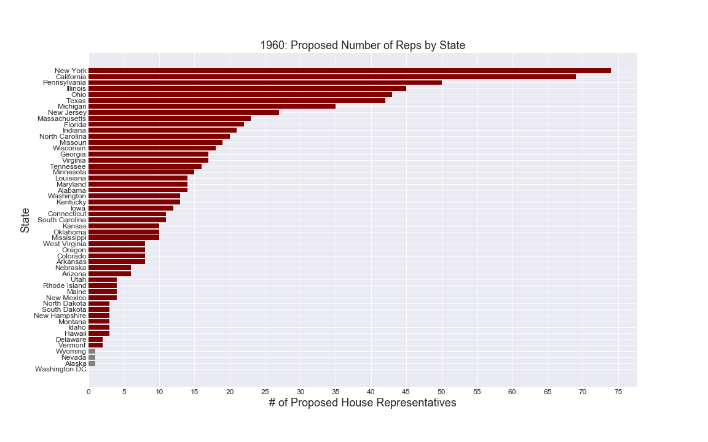
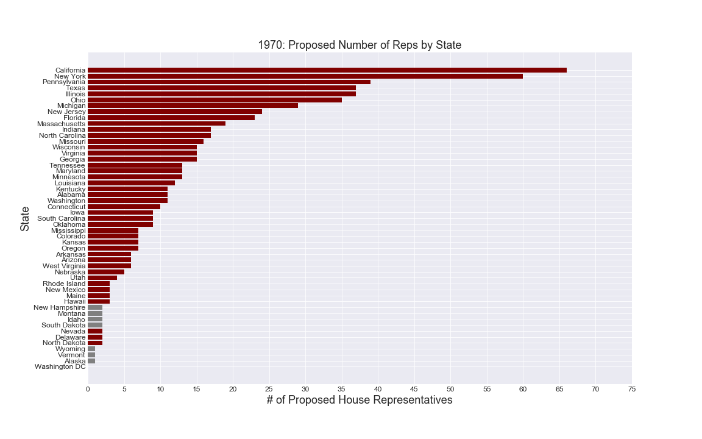
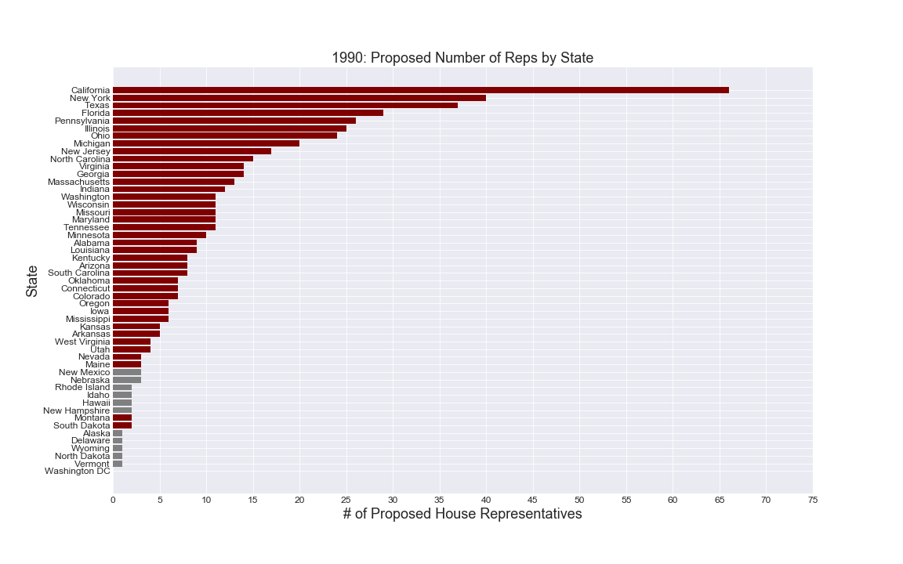
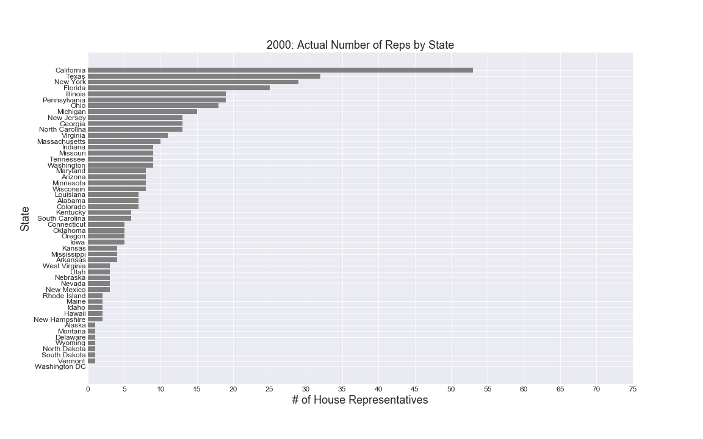
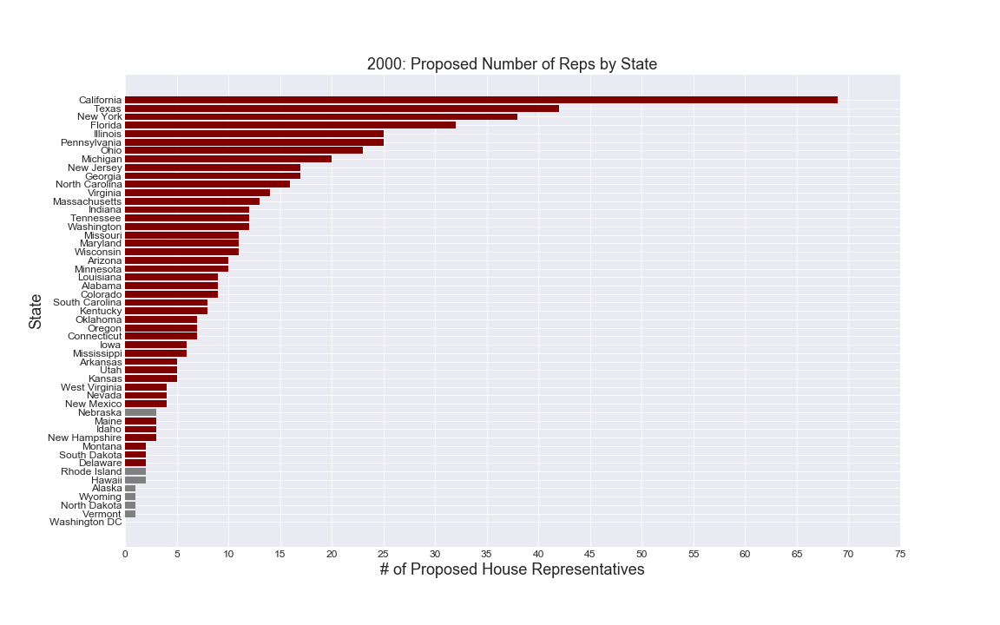
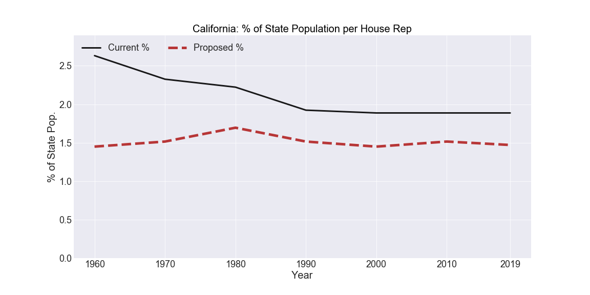
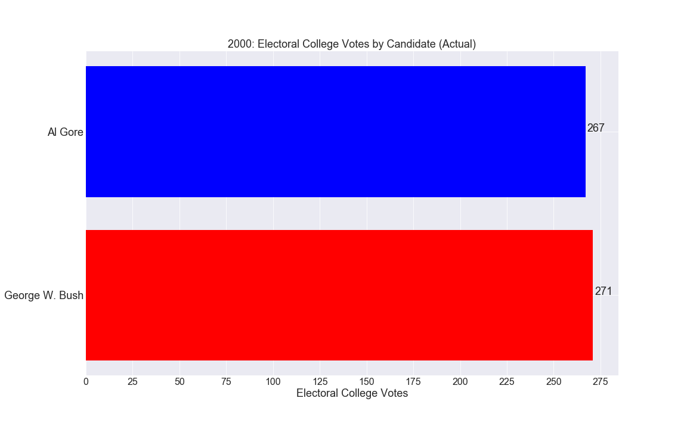

# Proposal to Revise the House of Representatives and, by extension, the Electoral College

The inspiration for this project started from a simple desire to evaluate how equal, or unequal, two votes from separate states can be in the general election for President of the United States of America. My initial hypothesis was that a single vote in California would be mathematically worth less than a single vote in Wyoming, based on a cursory analysis that a candidate could earn three (3) electors from Wyoming with less votes than it would take to earn three (3) electors from the very populous California. While the current election process does not allow for a candidate to earn only three (3) electors from California, the principle behind the math inspired me to attempt a proposal for a more equal, or "more perfect," system.

## Analysis Process

I pulled census data from 1960-2010 for population by state, and the most recent state population numbers from 2019 due to the fact that the 2020 census data is not yet available. Some of this data came from census.gov, while the rest of it came from Wikipedia. If anyone identifies inaccuracies in the state population numbers, this code can be rerun with those values amended and there should not be any errors. None of the state populations are hard-coded in the script.

I pulled data on which presidental candidates earned which electors from Wikipedia. Again, none of this is hard-coded and can be amended in the CSV file for re-running. The only error this may cause is for states with split congressional districts (Nebraska, Maine, and others depending on the election year) where different candidates won different districts. This did not pose an issue with the current numbers.

Script was written in Python using Jupyter Notebook and visualizations were made using matplotlib.pyplot.

## Results
### Process for Redistributing the Representatives

The system I proposed is based on the principle that the state with the lowest population is granted one (1) House Representative, and maintains that: 

-Each stat is granted two (2) Senators
-The number of electors is equal to the number of Senators and House Representatives for each state
-Washington D.C. remains a district, rather than a state, which results in zero (0) House Representatives, but they are granted the same number of electors as the least populous state, which will always be three (3) with this system

My proposed system is premised on the simple logic that a state's number of House Representatives should be equal to that state's population divided by the least populous state's population. In other words, if a state's population is five (5) times greater than Wyoming's, that state should have five (5) House Representatives.

### Representatives by State (Actual vs. Proposed)

Below are bar charts plotting the number of House Representatives for each state in the current and proposed systems. The actual values (current system) are indicated in light gray. In the "proposed" chart, a state's bar color is red if their number increased, dark gray if their number decreased, and light gray if their number is the same.

#### 1960

#### 1970

#### 1980

#### 1990

#### 2000

#### 2010

#### 2019

#### Percentage of State and National Populations per Representative

The figure that warrants a House Representative in this system is the number of people in a state, which means that there are going to be drastic discrepencies in the percentage of a state population assigned to a single House Representative. Since the least populous state (historically: Wyoming) will always have one representative, that representative is responsible for 100% of the state. The most populous state will have a much smaller percentage assigned to each of their Representatives.

On the surface, this can be misconstrued as disproportionate representation. The true measure of disproportionate representation is in how many actual constituents each Representative represents. Below is a figure showing the minimum (solid line) and maximum (dashed line) number of constituents represented in each year; the values for the current system of shown in BLACK, while the proposed system is shown in RED. You will see that the minimum and maximum number of constituents are consistently lower in the proposed system and, in 2019, the proposed maximum number of constituents is nearly equal to the current minimum. In other words, the proposed system would reduce the ratio to such an extent that the "worst" representation in the proposed system would be better than the "best" representation in the current system.

Another way to evaluate these discrepencies is to measure the difference between the most and least populous constituencies in each system. The ideal difference between the most and least populous constituencies is zero (0). The below graph indicates that the proposed system would reduce the current gap by about one-third.

### How Would This Affect the Electoral College?

For most elections between 1960 and 2020, the proposed system would have little-to-no effect. The victories in the Electoral College have typically been by such a margin that this redistribution would not change the results. There are, however, two elections that would have been notably affected.

#### 1960: Kennedy v. Nixon

Nixon's amount nearly doubles in the proposed system, and Virginia governor Harry Byrd (D) splits Kennedy's lead enough to change the future President of the United States of America. To remove Kennedy's presidency from our history is no insignificant act. From the Civil Rights Act, to the Bay of Pigs, to JFK and RFK's assassinations, to Lyndon Johnson's succession and response to Vietnam, to Watergate and our nation's only presdiential resignation, and to the Kennedy family legacy that has led to several generations of politicians including today's Robert Kennedy III (D-MA) in the House, the legacy of the Kennedy-Johnson-Nixon years cannot be understated. There is no way to discern what the 1960s would have looked like with Nixon defeating Kennedy, but it can certainly be said that nothing would have been the same.

#### 2000: Bush v. Gore

The 2000 election is one of the closest, and most contested, elections in our nation's history. Litigated in the courts and in the streets, this election is often discussed like a sporting match: some fans feel it was rigged, some fans feel it was fair, and some fans don't care either way. The most common place to find this election discussed today is in the debate over the Electoral College vs. the Popular Vote. While it may not have been the start of left-wing calls for abolishing the Electoral College, it was certainly the fuel behind the fire until Hillary Clinton lost to Donald Trump in similar fashion. In the proposed system, Bush and Gore end in a dead tie. In this situation, the House would determine the president-elect and the Senate would determine the vice president-elect. Given that the nature of this project is to reshape the House, I cannot determine what the party split would have been at the time to determine the president-elect. Fascinatingly, however, the Senate was also split 50-50 after the 2000 election. If everyone voted by their party, the choice for vice president-elect would have been determined by the sitting Vice President, as they are the tie-breaker in Senate decisions. The sitting Vice President was Al Gore. This is a political scenario I have never seen discussed, but I cannot imagine that Al Gore would get to be the deciding vote on his own future presidency. If anyone knows how this hypothetical scenario would have played out, please send the answer.

## Conclusion

I firmly believe that the current distribution of House Representatives and, by extension, the Electoral College is more disproportionate than necessary. I also firmly believe that the math I have suggested in this proposal for redistributing representatives is noncontroversial. The implications of that math will be controversial depending on which political party stands to lose its prowess, but if the goal is for a more perfect union, then surely we can take a party loss for a national gain. 